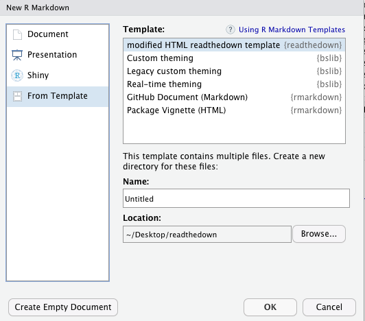

```{r setup, include=FALSE}
## Global options
knitr::opts_chunk$set(
  cache = FALSE,
  echo = TRUE
)
require(ggplot2)
require(dplyr)
require(glue)
require(kableExtra)
```

# Quick Start

## Install template package
```
devtools::install_github("6chaoran/readthedown")
```

## Create Rmarkdown from template
RStudio > File > New File > R Markdown ... > From Template



## Added features

1. logo options are added both inside the sidebar (logo) and main content (logo2)
2. favicon option is added
3. author avatar option is added
4. admonitions to differentiate level of attention
5. multiple columns layout to display content side by side
6. fixed css style of details & summary

## Cutsomize the template

Modify the `style.css` to further customize the markdown template


# Admonitions

currently support

* note: `.adm .adm-note`
* warning: `.adm .adm-warning`
* seealso: `.adm .adm-seealso`
* tip: `.adm .adm-tip`
* danger: `.adm .adm-danger`

```
::: {.adm .adm-note}
note

message
:::
```

::: {.adm .adm-note}
note

message
:::


```
:::{.adm .adm-warning}
warning

message
:::
```

:::{.adm .adm-warning}
warning

message
:::

```
:::{.adm .adm-seealso}
warning

message
:::
```

:::{.adm .adm-seealso}
seealso

message
:::

```
:::{.adm .adm-tip}
tip

message
:::
```

:::{.adm .adm-tip}
tip

message
:::


```
:::{.adm .adm-danger}
danger

message
:::
```

:::{.adm .adm-danger}
danger

message
:::

# Details/Summary

```
<details>
<summary>click me to view details</summary>
This is the details.
</details>
```

<details>
<summary>click me to view details</summary>
This is the details.
```{r}
data("mtcars")
p <- hist(mtcars$mpg)
tbl <- mtcars %>%
  head() %>%
  kable()
plot(p)
```

</details>

# Multiple Columns

## Two Columns
:::: {.cols}
::: {.cols-2}
```{r results='asis'}
cat("__column A__")
plot(p)
```
:::
::: {.cols-2}
```{r results='asis'}
cat("__column B__")
print(tbl)
```
:::
::::

## Three Columns

:::: {.cols}
::: {.cols-3}
```{r results='asis'}
cat("__column A__")
plot(p)
```
:::
::: {.cols-3}
```{r results='asis'}
cat("__column B__")
plot(p)
```
:::
::: {.cols-3}
```{r results='asis'}
cat("__column C__")
print(tbl)
```
:::
::::


# Chunks in Loop 

## plots in a loop {.tabset .tabset-pills}

```{r plots in a loop, results='asis'}
# chunk options: results='asis'
data("mtcars")
for(i in seq(4)){
  cat(glue::glue("\n\n### Tab {i} {{-}}\n\n"))
  plot.new()
  mtcars %>%
    sample_n(500, replace = TRUE) %>%
    pull(mpg) %>%
    hist()
  cat("\n\n")
}
```

## ggplot in a loop {.tabset .tabset-pills}

```{r ggplot in a loop, results='asis'}
# chunk options: results='asis'
data("mtcars")
for(i in seq(4)){
  cat(glue::glue("\n\n### Tab {i} {{-}}\n\n"))
  p <- mtcars %>%
    sample_n(500, replace = TRUE) %>%
    ggplot(aes(x = mpg)) +
    geom_histogram(bins = 30) 
  plot(p)
  cat("\n\n")
}
```

## kable in a loop {.tabset .tabset-pills}
```{r kable in a loop, results='asis'}
# chunk options: results='asis'
data("mtcars")
for(i in seq(4)){
  cat(glue::glue("\n\n### Tab {i} {{-}}\n\n"))
  p <- mtcars %>%
    sample_n(5, replace = TRUE) %>%
    knitr::kable()
  print(p)
  cat("\n\n")
}
```

## styled kable in a loop {.tabset .tabset-pills}
```{r styled kable in a loop, results='asis'}
# chunk options: results='asis'
data("mtcars")
for(i in seq(4)){
  cat(glue::glue("\n\n### Tab {i} {{-}}\n\n"))
  mtcars %>%
    sample_n(5, replace = TRUE) %>%
    knitr::kable("html") %>%
    kable_styling("striped", position = "left") %>%
    cat()
  cat("\n\n")
}
```